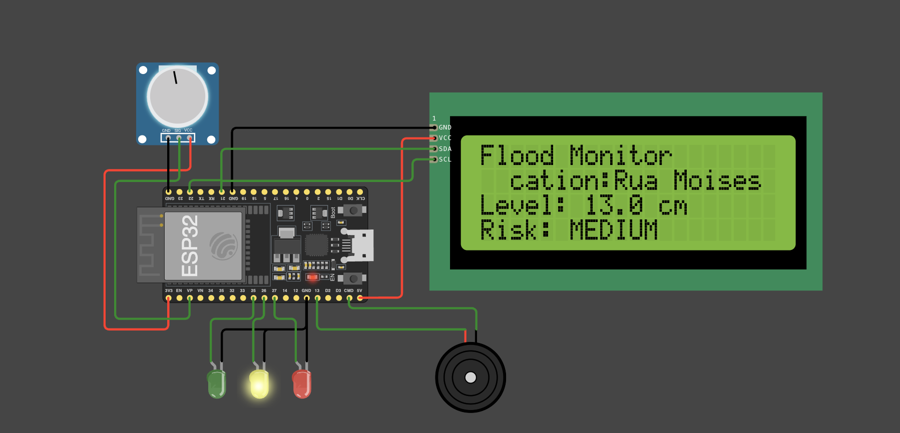
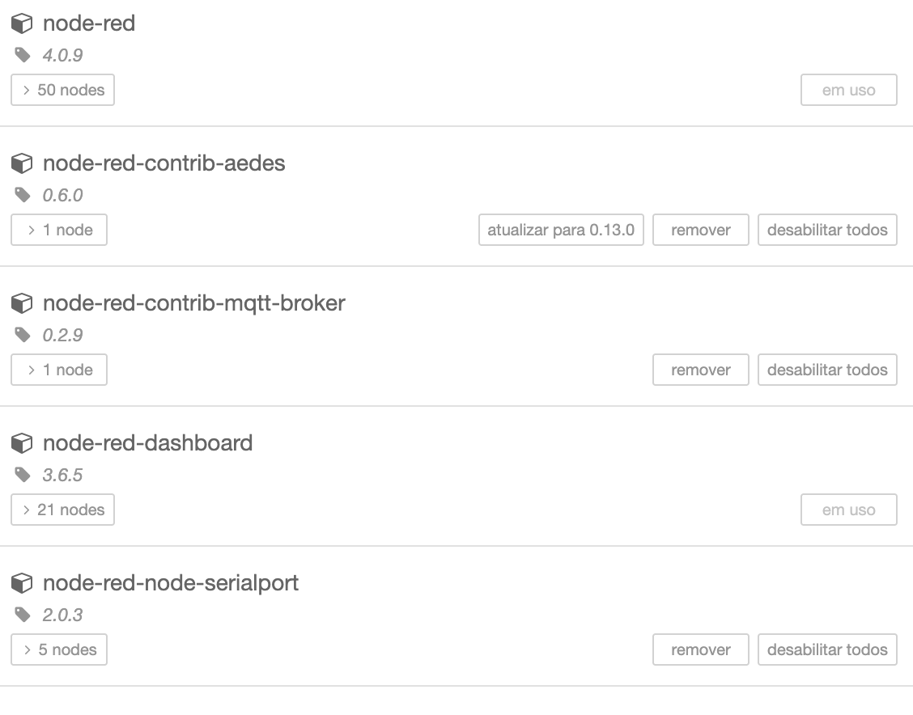
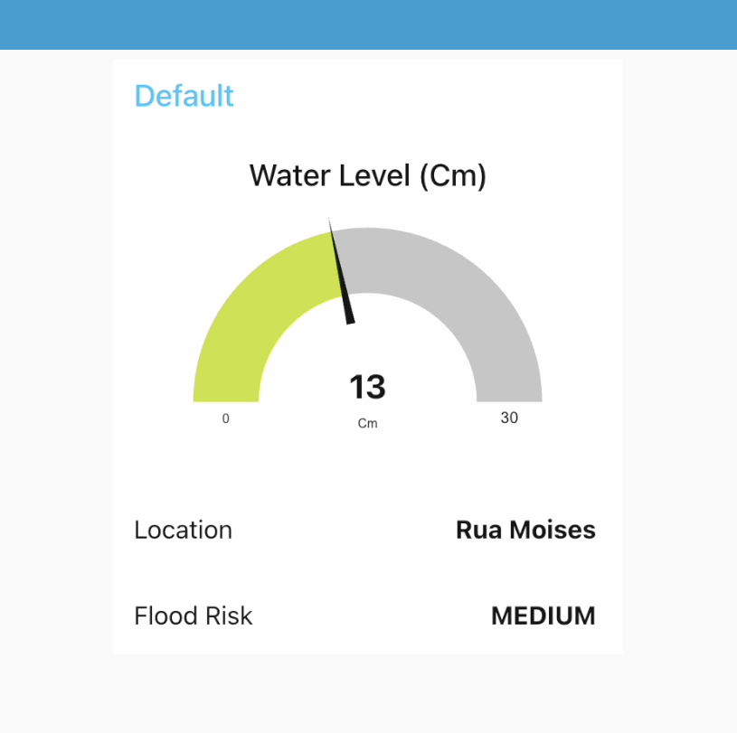
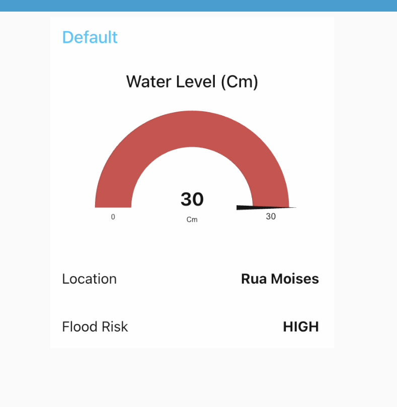
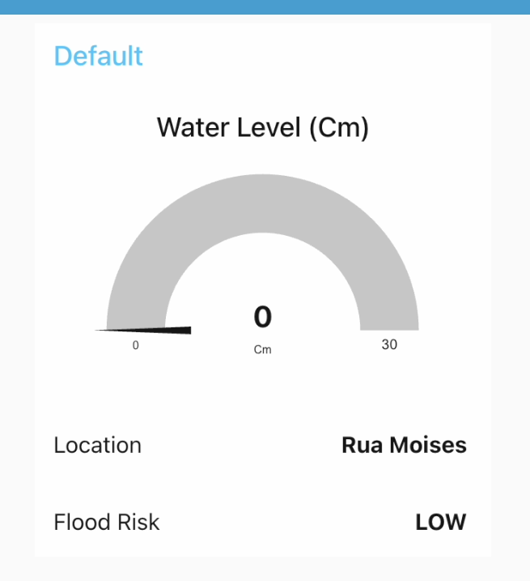

# Monitor de Inundação com ESP32

Este projeto implementa um sensor de monitoramento utilizando o ESP32. Ele mede o nível da água usando um sensor analógico, calcula o risco de inundação, exibe as informações em uma tela LCD, fornece indicação visual de risco usando LEDs e soa um alarme com um buzzer para situações de alto risco. O sistema também publica os dados de monitoramento em um broker MQTT, utilizando do Dashboard no Node-Red para display destas informações.

###
<h1 align="left">Integrantes</h1>

###

<h3 align="left">Ícaro Henrique de Souza Calixto - RM560278</h3>

###

<h3 align="left">Pietro Brandalise De Andrade - RM560142</h3>

###
<h1 align="left">Link simulador do sensor Wokwi</h1>

###

<h3 align="left">[Projeto Wokwi](https://wokwi.com/projects/432954060001352705)</h3>

###
<h1 align="left">Link vídeo da apresentação do sensor</h1>

###

<h3 align="left">[Vídeo youtube](https://youtu.be/1mje6pAreFo?si=y6pj6dBcxsvK9CIR)</h3>

###

## Funcionalidades

*   **Medição do Nível da Água:** Lê dados analógicos de um sensor de nível da água.
*   **Avaliação de Risco:** Determina o risco de inundação (BAIXO, MÉDIO, ALTO) com base no nível da água medido.
*   **Display LCD:** Mostra informações de monitoramento de inundação em tempo real (Localização, Nível, Risco).
*   **Indicadores LED:** LEDs Verde, Amarelo e Vermelho representam visualmente os níveis de risco BAIXO, MÉDIO e ALTO, respectivamente.
*   **Alarme Sonoro:** Ativa um buzzer quando o nível de risco é ALTO.
*   **Comunicação MQTT:** Publica dados de monitoramento de inundação (localização, nível, risco) em um tópico MQTT especificado.

## Hardware para construção

*   Placa de Desenvolvimento ESP32
*   Sensor Analógico de Nível da Água
*   Display LCD I2C (20x4 ou compatível)
*   LEDs Verde, Amarelo e Vermelho
*   Buzzer
*   Resistores (Se necessário)
*   Protoboard

## Diagrama do Circuito

Conecte os componentes conforme mostrado no diagrama abaixo, segue pinos para melhor compreensão:

**Conexões dos Pinos:**

*   Pino de Sinal do Sensor de Nível da Água -> ESP32 GPIO 36 (VP)
*   LCD I2C SDA -> ESP32 GPIO 21
*   LCD I2C SCL -> ESP32 GPIO 22
*   LED Verde -> ESP32 GPIO 25
*   LED Amarelo -> ESP32 GPIO 26
*   LED Vermelho -> ESP32 GPIO 27
*   Buzzer -> ESP32 GPIO 13
*   VCC do Sensor de Nível da Água -> ESP32 3.3V/5V
*   GND do Sensor de Nível da Água -> ESP32 GND
*   VCC do LCD -> ESP32 5V
*   GND do LCD -> ESP32 GND
*   LEDs e Buzzer: Conecte o outro terminal através de um resistor ao GND (LEDs) ou diretamente ao GND (Buzzer, se for ativo).

## Requisitos de Software

*   Bibliotecas Necessárias Wokwi:
    *   `Wire.h` 
    *   `LiquidCrystal_I2C.h`
    *   `WiFi.h` 
    *   `PubSubClient.h`

Este projeto se integra com o Node-RED para visualização dos dados por meio da dashboard. 
Bibliotecas necessárias Node-RED:

*   `node-red-contrib-aedes` (MQTT Broker)
*   `node-red-contrib-mqtt-broker` (Outro nó de MQTT Broker)
*   `node-red-dashboard`

## Configuração e Uso

1.  **Abra o Projeto:** Abra o arquivo `main.ino` na sua IDE ou projeto.
2.  **Instale as Bibliotecas:** Certifique-se de ter instalado as bibliotecas `LiquidCrystal_I2C` e `PubSubClient`.
3.  **Configure as Definições:**
    *   Atualize a variável `sensorID` com o nome de localização desejado.
    *   Insira seu SSID e senha do Wi-Fi nas variáveis `ssid` e `password`.
    *   Verifique ou altere o `mqttServer` e `mqttPort` se estiver usando um broker MQTT diferente.
4.  **Carregue o Código:** Selecione a placa ESP32 e a porta corretas, então carregue o código para o seu ESP32.

## Dashboard

Aqui estão algumas capturas de tela mostrando o display LCD em diferentes níveis de água e risco:

**Risco Médio (13.0 cm)**

**Risco Alto (30.0 cm)**

**Risco Baixo (0.0 cm)**

